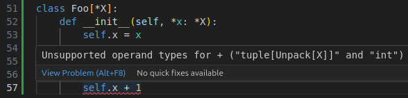

# The Zuban Language Server

**FOR NOW ZUBANLS IS PRE-ALPHA, CONTACT info@zubanls.com IF YOU WANT TO TRY IT**

ZubanLS is a Mypy-compatible, high-performance Python Language Server
implemented in Rust, by the author of [Jedi](https://github.com/davidhalter/jedi).

Currently only diagnostics are supported, feel free to use the [Jedi Language
Server](https://github.com/pappasam/jedi-language-server/) for autocompletion,
goto and renames.

{ref}`Installing ZubanLS <installation_start>`

ZubanLS passes over 90% of Mypy’s relevant test suite and offers comprehensive
support for Python's {ref}`type system <type_features>`.



## Chapters

```{toctree}
:maxdepth: 2

installation.md
usage.md
features.md
license.md
comparison.md
```
